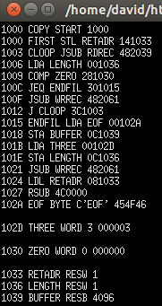
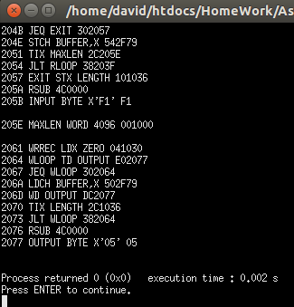
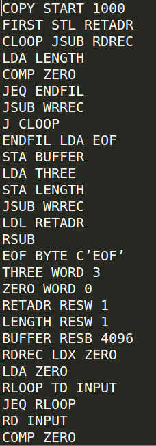
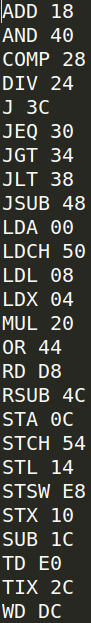

SIC Assembler (Pass 1)
########################

目錄:
--------

.. contents:: :local:

Language : C++
-----------------
.. image:: CPlusPlus.jpg
    :height: 300
    :width: 300

使用方式 
-----------------
把想要轉換的組語，命名為
``input.txt``
然後執行
``assembler.cpp``
， 
``location``
和
``object code``
就會顯示在螢幕上了

Screenshots
-----------

轉換後的結果
~~~~~~~~~~~~~~

.. _Bootstrap: https://getbootstrap.com/

讀取的檔案內容
~~~~~~~~~~~~~~~

License
-------

SIC Assembler is released under the permissive `New BSD license`_.

.. _`New BSD license`: https://github.com/django-oscar/django-oscar/blob/master/LICENSE