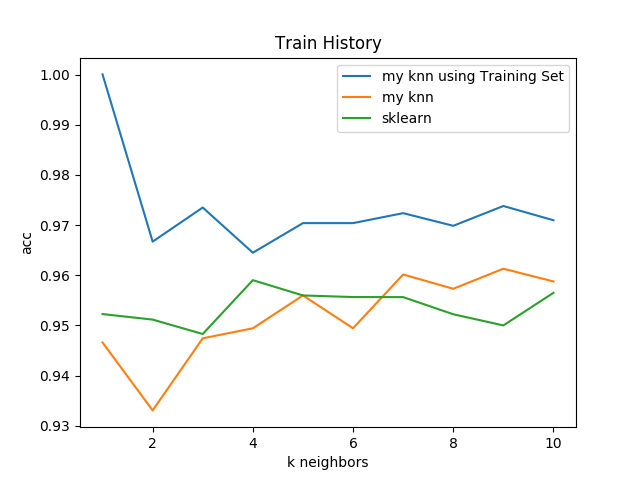

# Self-Implementation of KNN

4103056011 中興資工四 張泰瑋

`平均執行時間為：0.14261221885681152 seconds`

## RUN

* `python3 knn.py`

## Details

* Normalized the raw datas with `Normalizer`, powerd by sklearn:`scaler = Normalizer().fit(X)`
	* Also compare the acc with min-MAX normalization, the result is provided below.
* Use euclidean distance to calculate distance:`np.linalg.norm(np.array(input_vec)-np.array(v))`
* Use `KFold` function powered by sklearn to do cross-validation:`KFold(len(self.data), n_folds=self.fold, shuffle=True)`
* Visulized the acc curve with `matplotlib`:
```
def visualize(self, k):
		mylist, klist = [], []
		for i in range(1, k+1):
			my_acc, k_acc = self.evaluate(k=i)
			mylist.append(my_acc)
			klist.append(k_acc)
		# axes = plt.gca()
		# axes.set_ylim([0.419,0.44])
		plt.plot(range(1, k+1), mylist, label='my knn')
		plt.plot(range(1, k+1), klist, label='sklearn')
		plt.title('Train History')
		plt.ylabel('acc')
		plt.xlabel('k neighbors')
		plt.legend(loc='best')
		plt.show()
```

## Visualization

1. Normalization:

	
2. min-Max normalization:

	
	
## Conclusions

1. My knn's performance is comparable with sklearn's knn, and the accuracys are the same when `k = 5`
2. normalization and min-Max normalization each work fine in this case.

