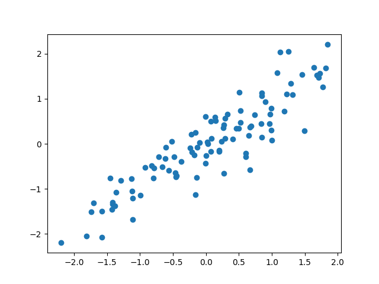
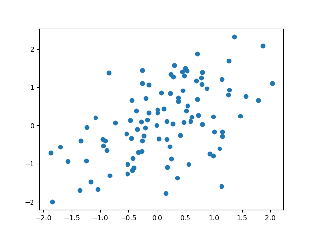

# Generate the Gaussian distributed datasets as shown in [stationary random process.pdf](https://docs.wixstatic.com/ugd/33750e_84919aa1813c45fb89a4250e17edd18f.pdf)

4103056011 中興資工四 張泰瑋

## Reference

<http://www.aishack.in/tutorials/generating-multivariate-gaussian-random/>

Almost use the same code from this tutorial

But change it from 2 dimension into 20 dimension

## RUN

* `python3 gaussion_distribution.py`

## Details

1. We define a function that generates a 1D Gaussian random number for us:

```
def get_gaussian_random():
	m = 0
	while m == 0:
		m = round(np.random.random() * 100)
	numbers = np.random.random(int(m))
	summation = float(np.sum(numbers))
	gaussian = (summation - m/2) / math.sqrt(m/12.0)
	return gaussian
```

2. Use `get_gaussian_random` to generate several n-dimensional Gaussian random numbers with a zero mean and identity covariance:
```
def generate_known_gaussian(dimensions, count):
	ret = []
	for i in range(count):
		current_vector = []
		for j in range(dimensions):
			g = get_gaussian_random()
			current_vector.append(g)
		ret.append(current_vector)
	return ret
```

3. Generate Staionary random process matrix as covariance matrix:
```
def stationary_random_process(dimension):
	stationary = np.zeros((dimension, dimension))
	np.fill_diagonal(stationary, 1)
	max_len = len(stationary)
	p1, p2 = 1, 1
	for axis in range(len(stationary)):
		another_axis = 0
		axis_backup = axis
		while axis < max_len and another_axis < max_len:
			stationary[axis, another_axis] = p1
			axis += 1
			another_axis += 1
		p1 *= 0.9
		another_axis = 0
		axis = axis_backup
		while another_axis < max_len and axis < max_len:
			stationary[another_axis, axis] = p2
			another_axis += 1
			axis += 1
		p2 *= 0.5
	return stationary
```

4. Using inverse whitening transform to transform this random Gaussian vector so that it lines up with the mean and covariance provided by the user:
```
def main(dimension, count):
	known = generate_known_gaussian(dimension, count)
	target_cov  = np.matrix(stationary_random_process(dimension))
	eigenvalues, eigenvectors = np.linalg.eig(target_cov)
	# 簡單的證明eigenvalue和eigenvector沒算錯
	print("簡單的證明eigenvalue和eigenvector沒算錯", np.dot(target_cov, eigenvectors) == np.multiply(eigenvalues, eigenvectors))
	l = np.matrix(np.diag(np.sqrt(eigenvalues)))
	Q = np.matrix(eigenvectors) * l
	x1_tweaked = []
	x2_tweaked = []
	tweaked_all = []
	for original in known:
		original = np.matrix(original).T
		tweaked = Q * original
		x1_tweaked.append(tweaked[0])
		x2_tweaked.append(tweaked[1])
		tweaked_all.append(tweaked)

	plt.scatter(x1_tweaked, x2_tweaked)
	plt.show()
```


## Visualization

1. `p=0.9`:



2. `p=0.5`:
					


## Conclusions

I'm much more understanding about whitening and gaussian distribution.
