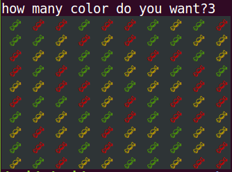
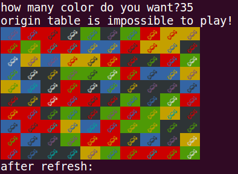
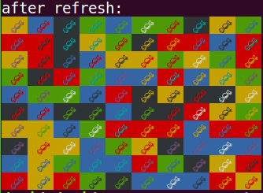

# CandyTable

一個產生出CandyCrush初始table的小工具

## Getting Started

These instructions will get you a copy of the project up and running on your local machine for development and testing purposes. See deployment for notes on how to deploy the project on a live system.

### Prerequisities

本套件pythno2跟python3皆通用  
若不能執行麻煩回報`Pull Requests`

### Installing

* 安裝 Install：`pip install CandyTable`

## Running & Testing

## Run

執行下列指令：
```
import CandyTable
c = CandyTable.CandyTable(10,10)
c.main()
```

* 輸入想要的顏色數量：
  
* 最高支援到35色，若初始圖片不可能讓三顆糖果連線，則自動refresh：
  

  
* 取得這張CandyTable的資訊：  
  `a.table`：
  ```
  {
    10: u'\x1b[0;33;40m \U0001f36c \x1b[0m',
	11: u'\x1b[0;33;40m \U0001f36c \x1b[0m',
	12: u'\x1b[0;32;40m \U0001f36c \x1b[0m',
	13: u'\x1b[0;31;40m \U0001f36c \x1b[0m',
	14: u'\x1b[0;33;40m \U0001f36c \x1b[0m',
	15: u'\x1b[0;33;40m \U0001f36c \x1b[0m',
	16: u'\x1b[0;32;40m \U0001f36c \x1b[0m',
	17: u'\x1b[0;31;40m \U0001f36c \x1b[0m',
	18: u'\x1b[0;33;40m \U0001f36c \x1b[0m',
	19: u'\x1b[0;32;40m \U0001f36c \x1b[0m',
	...
	108: u'\x1b[0;33;40m \U0001f36c \x1b[0m',
	109: u'\x1b[0;33;40m \U0001f36c \x1b[0m'
}
  ```  
  x座標為1~10，y座標為0~9  
  字串一樣代表該位置的糖果是一樣的。

### Break down into end to end tests

not yet.

### And coding style tests

目前沒有coding style tests...

## Deployment

CandyTable 只是一個小玩具而已，`pip install CandyTable` 就好

## Built With

* python2.7

## Contributors

* **張泰瑋** [david](https://github.com/david30907d)

## License

This package use `GPL3.0` License.

## Acknowledgments
