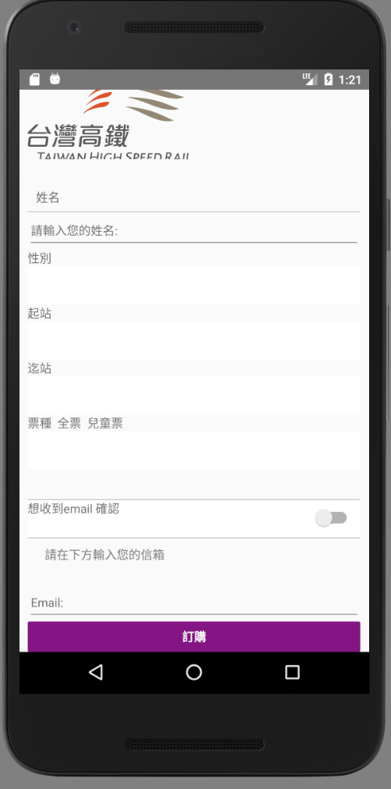
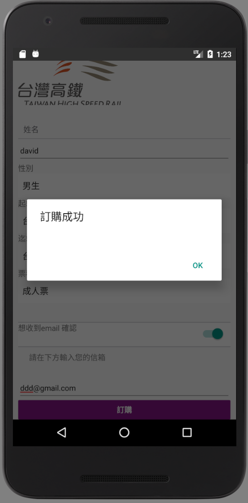

# 使用方法
作業皆使用[React Native](https://facebook.github.io/react-native/docs/handling-text-input.html#content)完成  
是由`Facebook`開發的APP框架，能夠使用`JavaScript`的親戚 `JSX` 去撰寫APP  
`Facebook` 的APP就是用這種框架開發  
優點就是可以直接用網頁技術轉成APP  
而且可以寫一次就轉換成`android` 和 `ios`  
而且執行速度近似於原生的APP  
在開發速度、美工套件、函式庫上都不是Java、Swift比的上的
唯一的缺點就是當功能複雜時，速度會輸Java、Swift  

## 安裝 React Native

請參照[Facebook安裝教學](https://facebook.github.io/react-native/docs/getting-started.html)，一步一步照做  

* Linux幾乎全部都可以用npm安裝
* Windows除了安裝步驟都跟Linux差不多外，還需要進`bios`，把一個虛擬化技術XX的開關打開，調成`enable`  

## 開始寫程式  

Use the React Native command line interface to generate a new React Native project called 專案名稱, then run react-native run-android inside the newly created folder.
1. 建立專案：  
開啟terminal，輸入下列指令  
  > react-native init 專案名稱  
  > cd 專案名稱  
  > react-native run-android
2. 開始寫：
  * 如果是要寫給`Android`，請寫在`index.android.js`
  * 如果是要寫給`ios`，請寫在`index.ios.js`

If everything is set up correctly, you should see your new app running in your Android emulator with methods listed below.

## 執行  

1. 在網頁測試（`Recommended`）：  
將本次作業，`index.android.js`貼到此[頁面](https://facebook.github.io/react-native/docs/props.html)  
facebook 提供的線上Compiler能夠讓開發時  
模擬器的重新載入時間縮到最短

2. 實際裝到手機上：  
開啟`Android Studio`然後如圖所示：  
  
You can see the list of available AVDs by opening the "AVD Manager" from within Android Studio. You can also run the following command in a terminal:
> android avd

## 製作方法:
使用google 搜尋 `react native form generator` [網址](https://medium.com/@michaelcereda/react-native-forms-the-right-way-315802f989d6)  
把他的範例程式碼全部複製下來即可完成此次作業 [他的github專案](https://github.com/APSL/react-native-keyboard-aware-scroll-view)

## 效果

