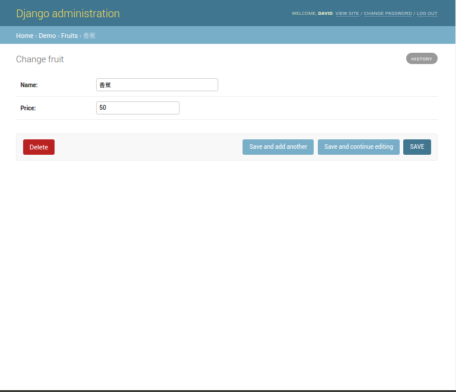

# React js實作的sqlite demo作業

因為react體系沒有辦法接sqlite，所以結合了python網頁框架django當做app的後端  
這樣就可以從手機連到sqlite

## 使用到的技術:
- react-native
- django
- semantic-ui-react

# 使用方法
作業皆使用[React Native](https://facebook.github.io/react-native/docs/handling-text-input.html#content)完成
是由`Facebook`開發的APP框架，能夠使用`JavaScript`的親戚 `JSX` 去撰寫APP
`Facebook` 的APP就是用這種框架開發
優點就是可以直接用網頁技術轉成APP
而且可以寫一次就轉換成`android` 和 `ios`
而且執行速度近似於原生的APP
在開發速度、美工套件、函式庫上都不是Java、Swift比的上的
唯一的缺點就是當功能複雜時，速度會輸Java、Swift

## 安裝 React Native

請參照[Facebook安裝教學](https://facebook.github.io/react-native/docs/getting-started.html)，一步一步照做

* Linux幾乎全部都可以用npm安裝
* Windows除了安裝步驟都跟Linux差不多外，還需要進`bios`，把一個虛擬化技術XX的開關打開，調成`enable`

## 開始寫程式

Use the React Native command line interface to generate a new React Native project called 專案名稱, then run react-native run-android inside the newly created folder.
1. 建立專案：
開啟terminal，輸入下列指令
  > react-native init 專案名稱
  > cd 專案名稱
  > react-native run-android
2. 開始寫：
  * 如果是要寫給`Android`，請寫在`index.android.js`
  * 如果是要寫給`ios`，請寫在`index.ios.js`

If everything is set up correctly, you should see your new app running in your Android emulator with methods listed below.

## 執行

1. 實際裝到手機上：
開啟`Android Studio`然後如圖所示：

You can see the list of available AVDs by opening the "AVD Manager" from within Android Studio. You can also run the following command in a terminal:
> react-native run-android

## 效果：

1. 首頁： 
1. 先透過django建立sqlite+建立sqlite管理員密碼+建立資料庫schema：
1. 登入資料庫admin：
1. sqlite後端介面，按一下右上角灰色的add fruit按鈕：
1. 然後就可以填水果的名子和價錢：
1. 填完資料然後按右下角的save：
1. 以此類推就可以存入好幾個資料：
1. 點一下就可以修改資料：
1. 修改中：
1. 修改後的結果：
1. 再按一下就可以刪除：
1. 會顯示確認頁面：
1. 刪除後的結果：
1. 搜尋頁面：
1. 搜尋頁面：
